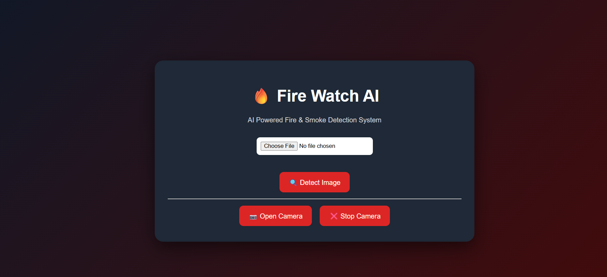

# 🔥 Fire Watch AI

AI-powered Fire and Smoke Detection System using **YOLO, FastAPI, OpenCV, HTML, CSS, and JavaScript**.

## 📌 Project Overview

Fire Watch AI is a computer-vision-based application designed to detect **fire and smoke** from images and camera frames.

The system uses a trained YOLO model (`best.pt`) for detection and a FastAPI backend to process the input and return detection results.
#UI

## ✨ Features

- 🔥 Fire detection
- 💨 Smoke detection
- 🤖 YOLO-based object detection
- 📷 Camera feed support
- 📸 Capture and detect from camera
- 🖼️ Image upload and detection
- 🚨 Alarm when fire or smoke is detected
- 📊 Detection confidence display
- ⚡ FastAPI backend
- 🌐 Simple web interface

## 🛠️ Technologies Used

- Python 3.11
- FastAPI
- Uvicorn
- Ultralytics YOLO
- OpenCV
- NumPy
- HTML
- CSS
- JavaScript

## 📂 Project Structure

```text
AI_Fire_watch/
│
├── app.py
├── best.pt
├── README.md
├── screenshot/
│   └── Screenshot.png
└── .gitignore
